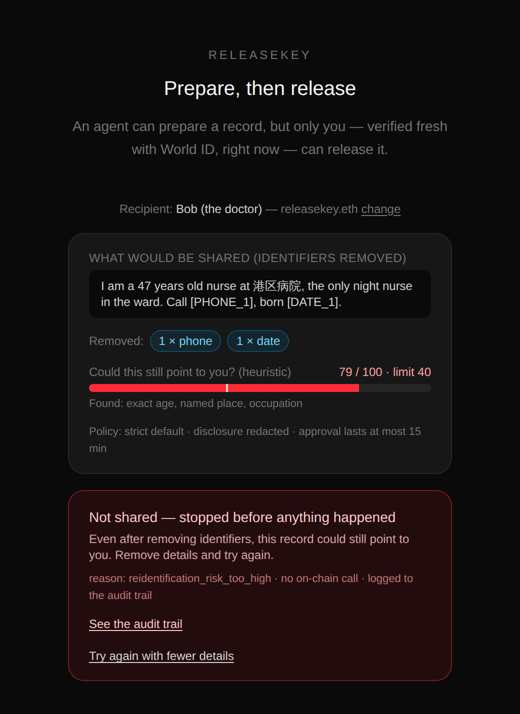
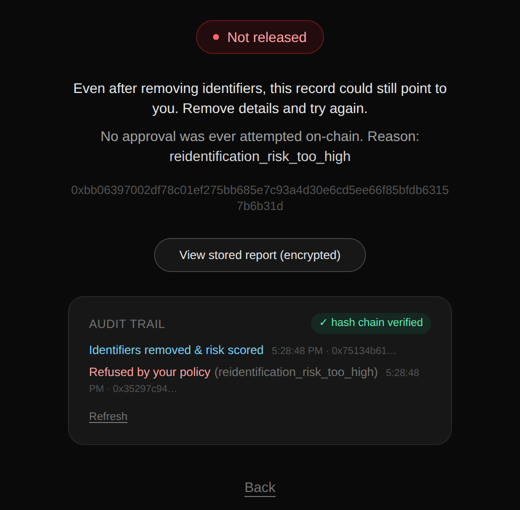

# HAIS Agent v2 設計書（日本語概要）

作成：Hideki Tamae ／ 2026年9月30日
正式な仕様：[`SPEC-v2.md`](../../SPEC-v2.md)（英語）　今後の計画：[`ROADMAP.md`](./ROADMAP.md)　分析の根拠：[`ANALYSIS.md`](./ANALYSIS.md)

---

## 1. 一言でいうと

**AIは記録を「準備」できるが、外に出せるのは「本人のルールが許す最小限」だけ。出すには毎回その場の人間の承認が必要で、止めた記録も出した記録と同じように全部見える。**

## 2. なぜ v2 なのか（ETHGlobal Tokyo 2026 から学んだこと）

| 分かったこと | 手本にした作品 | v2 に取り入れたもの |
|---|---|---|
| 評価されたのは「AIが働き、人間が最終権限を持ち、その境界を動くデモで見せた」作品 | Omamori（ファイナリスト）、Airlock（World賞） | v1の「AIは単独で出せない」を守ったまま、境界を**画面で見える**ようにした |
| Airlockは「伏せ字化 → 特定されないか再確認 → ENSのルール → 人間の承認 → 改ざんできない記録」でWorld賞を受賞 | Airlock | **最小限の開示・再特定チェック・ENS上のルール・ハッシュチェーン監査ログ**を追加 |
| Yohakuは依頼を「自動／人間／拒否」に順番のルールで振り分け、失敗したら拒否に倒し、断った依頼も見せる | Yohaku | **順番に判定し、失敗したら拒否する判定ルーター**を追加 |
| Omamori（高齢者版）は家族のルールをAIが書き換えられないENSの記録に置いた | Omamori（ENS） | ルールは**本人のENSの記録**に置き、毎回読み直す |
| v1で評価されにくかった可能性（推測）：成果が画面で見えない、拒否の実演が弱い | — | 「何が共有されるか・何を消したか・危険度・どのルールか・拒否の理由」を全部表示 |

## 3. Before（v1）と After（v2）

| 項目 | Before：v1（タグ `v1-ethglobal-tokyo-2026`） | After：v2（ブランチ `v2`） |
|---|---|---|
| 共有する中身 | 話した文章をそのまま暗号化 | 電話・メール・ID番号・郵便番号・日付・URLを**伏せ字に置き換えてから**暗号化。元の値は保存も返却もしない |
| 特定されるリスク | 見ていない | 年齢・地名・職業・家族・珍しい属性などの組み合わせを 0〜100 で採点 |
| ルール | コードに固定（有効期限15分） | 本人のENSのテキストレコード（`com.releasekey.policy.*`）から読む。未設定・不正な値は**厳しい既定値**に倒す |
| 判定 | World IDが通れば承認 | その前に順番のルールで判定。ルール違反なら**チェーンに一切触れずに拒否**。自動で出す道は存在しない |
| 拒否の見え方 | World ID失敗時の理由コードのみ | 理由を日常の言葉で表示＋「何が共有されるはずだったか」を表示 |
| 記録 | チェーン上の Created / Approved / Revoked のみ | 全ステップ（拒否・閲覧・閲覧拒否を含む）を**ハッシュでつないだ監査ログ**に記録し、改ざんを検出。個人情報は入れない |
| 有効期限 | 固定15分 | 本人のルールで決める（上限はコントラクトの1時間） |
| スマートコントラクト | デプロイ済み | **変更なし**（同じアドレスのまま使える） |
| テスト | 16（コントラクト）＋13（Web） | 16（コントラクト）＋47（Web）。追加34件 |

画面（v2）：

| 拒否の瞬間 | 監査ログ |
|---|---|
|  |  |

## 4. 判定ルール（上から順に、最初に当てはまったものが結果）

1. 宛先が名簿にない → 拒否（`unknown_recipient`）
2. 本人のルールで許されていない宛先 → 拒否（`recipient_not_allowed`）
3. 中身が空 → 拒否（`empty_content`）
4. 伏せ字化が必要なのにされていない → 拒否（`redaction_missing`）
5. 特定リスクがルールの上限を超える → 拒否（`reidentification_risk_too_high`）
6. それ以外 → **人間の承認へ**（World ID）。自動で出すことはない

## 5. データの境界（v2）

- 元の文章：本人の端末と、準備処理の1リクエストの間だけサーバーのメモリにある。**保存しない・ログに出さない・チェーンに載せない**
- 伏せ字の対応表：**どこにも保存しない**（あとから元に戻す手段を作らない）
- 伏せ字化した文章：宛先のENS公開鍵で暗号化し、チェーンの外に置く
- 監査ログ：出来事の種類・記録ID・理由コード・件数だけ。中身と個人情報は**入れられない**（入れようとするとエラー）
- チェーン：v1と同じ（ランダムID・ソルト付きハッシュ・大まかな出来事だけ）

## 6. 正直な限界

- 伏せ字化と特定リスクの採点は**ルールベースの目安**で、完全ではない（文章中の人名などは取りこぼしうる）。だからこそ最後は人間の承認を必須にしている。
- 監査ログとレコードはデモ用に**サーバーのメモリ**にある（再起動で消える）。Phase 2で永続化し、ログの先頭ハッシュをチェーンに刻む。
- 承認側の流れ（World ID → Sepolia）は v1 と同じ仕組みで、v2の変更後にもう一度、実機で確認する必要がある。
- 医療・ケアの情報は「要配慮個人情報」にあたりうる。実データで使う前に法的な確認が必要。

## 7. 次の段階（詳細は ROADMAP）

- **Phase 2（設計済み）**：MynaWallet（マイナンバーカードの公的な電子証明書）で医師・ケア職の本人性を証明／JAW.id の権限設定でAIの鍵の範囲を制限／ENSv2で本人ごとのサブネームと細かい権限／記録の永続化
- **Phase 3（構想）**：AIが人間のケアデータを使うときに、同意・最小開示・証明・**本人への対価（x402など）**を一つの流れで保証する「人間データの層」。SOLUNA（Proof of Care）との接続
